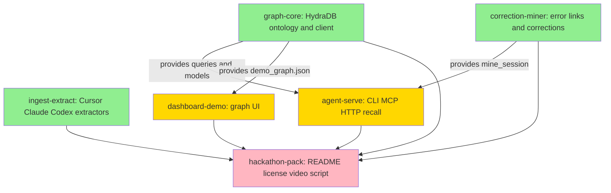

# SCAR — Parallel Development Plan

## Overview

**SCAR** (Stored Corrections And Recall) is a correction graph for coding agents.

People already have years of Cursor, Claude Code, and Codex history sitting on disk. SCAR extracts those transcripts and stores the **corrections and the error connections** so the next agent session does not commit the same mistake.

That is a **graph** problem, which is why it belongs on HydraDB OSS (`github.com/hydra-db/hydradb`) rather than a vector store:

- "What did we already ban in this repo?" is not cosine similarity.
- "This function failed; what corrections exist on its callers?" is a `CALLS` traversal.
- "Which other services import the file that just blew up with this signature?" is an `IMPORTS*` blast radius.
- "We used to say X; now we say Y" is a `SUPERSEDES` edge with chronology.
- "I have never seen this" must **abstain**, not invent a house rule. Track 3's failure mode (long-context models hallucinating when the fact is not in history) is the product constraint.

**Hackathon constraints (non-negotiable):**

- Today is submission day (Aug 20, 2026, 11:59 PM PT). Parallelize Wave 1 immediately.
- HydraDB OSS must do real work: OpenCypher over Bolt `7687` / HTTP `8443` against `graph-node`. Do not use `api.hydradb.com` as the system of record.
- Fresh git history in this repo. Existing libraries are allowed. Do not submit a fork of an existing extractor toolkit.
- Teams 1–4, public GitHub, MIT/Apache license, ≤3 minute demo video.

This workspace (`/Users/kaizen/Desktop/enforce`) was empty. There is no legacy application code. All implementation happens on parallel branches from `main`.

## Architecture

```
 Cursor / Claude Code / Codex (local disk)
              |
              v
     extractors (ingest-extract)
              |
              v
     frozen JSONL transcripts
              |
              v
     miner (signatures, LED_TO, SUPERSEDES, antipatterns)
              |
              v
     HydraDB OSS graph-node  <--- ontology + named Cypher (graph-core)
              |
        +-----+-----+
        |           |
        v           v
   CLI / MCP / HTTP           Demo UI (dashboard-demo)
   (agent-serve)              recall + blast radius visualization
```

**Why this cannot be "just embeddings":** a chunk that says "use utcnow" and a chunk that says "never use utcnow" are semantically close and chronologically opposed. Vector recall will surface both. The graph keeps one active `Correction` and a `SUPERSEDES` edge to the dead one.

### Graph ontology

```
(:Session)-[:IN_REPO]->(:Repo)
(:Session)-[:HAS_TURN]->(:Turn)
(:Turn)-[:TOUCHED]->(:File)
(:Turn)-[:MENTIONS]->(:Symbol)
(:Turn)-[:EMITTED]->(:Error)
(:Error)-[:IN_FILE]->(:File)
(:Error)-[:ON_SYMBOL]->(:Symbol)
(:Error)-[:SAME_AS]->(:Error)
(:Error)-[:LED_TO]->(:Error)
(:Error)-[:INSTANCE_OF]->(:AntiPattern)
(:Correction)-[:FIXES]->(:Error)
(:Correction)-[:STATED_IN]->(:Turn)
(:Correction)-[:SUPERSEDES]->(:Correction)
(:AntiPattern)-[:FORBIDDEN_IN]->(:Repo)
(:File)-[:IMPORTS]->(:File)
(:Symbol)-[:CALLS]->(:Symbol)
(:Constraint {rule, active}) linked from AntiPattern
```

### Frozen transcript JSON (shared by ingest-extract and correction-miner)

See `worktrees/ingest-extract/TASK.md`. Neither task imports the other. Both emit/consume this JSON. `scar/models.py` is owned by graph-core and maps the **graph** entities, not the transcript wire format.

### HydraDB runtime

Use the published image and the OSS README's plaintext docker flow:

- Image: `ghcr.io/hydra-db/hydradb:latest`
- Bolt `127.0.0.1:7687`, HTTP `127.0.0.1:8443`, admin `127.0.0.1:9090`
- Token file: `local-development-token-32-bytes`
- `GRAPH_ALLOW_PLAINTEXT=true`, `RUST_MIN_STACK=33554432`

Python talks via `neo4j` Bolt driver (`scar/graph/client.py`). Named operations live in `scar/graph/queries.py`. Other packages call those names; they do not inline Cypher.

## Dependency Graph



**Legend:**

- Green: No dependencies (Wave 1) — run three Claude instances at once
- Yellow: Depends on Wave 1 (Wave 2)
- Pink: Depends on Wave 2 (Wave 3)

`correction-miner` is Wave 1 even though it conceptually follows extraction, because the transcript schema is frozen in this plan. It ships its own copies of the synthetic fixtures.

## Execution Strategy

**Parallel Waves:**

- **Wave 1** (no dependencies): `graph-core`, `ingest-extract`, `correction-miner`
- **Wave 2** (depends on Wave 1): `agent-serve` (needs graph-core + miner), `dashboard-demo` (needs graph-core fixture)
- **Wave 3** (integration / judges): `hackathon-pack`

**Deadline compression:** treat each estimate as a hard cap. If HydraDB docker is slow, graph-core still lands mocked unit tests plus compose file; live integration test is marked `pytest.mark.integration`.

**Git:** this directory is a new repo on `main` with no commits yet. Create an initial commit of the workspace files **before** `/work-on`, or `worktree-setup.sh` will refuse to run.

## Subtasks

### Subtask 1: HydraDB ontology and client

- **ID**: graph-core
- **Priority**: 1
- **Dependencies**: None
- **Estimated**: 3 hours
- **Status**: pending
- **Branch**: `parallel/graph-core-hydradb-ontology`
- **Files**: `docker-compose.yml`, `scar/graph/*`, `scar/models.py`, `schema/ontology.cypher`, `fixtures/demo_graph.json`

**Objective**: Local HydraDB OSS node plus the only Cypher layer in the project.

**Implementation highlights**:
1. Official plaintext `graph-node` compose stack
2. Named queries: upsert_*, recall_for_context (active + supersession + neighborhood + abstain), blast_radius
3. Seed fixture that the UI can render even before live recall

---

### Subtask 2: Assistant transcript extractors

- **ID**: ingest-extract
- **Priority**: 1
- **Dependencies**: None
- **Estimated**: 3 hours
- **Status**: pending
- **Branch**: `parallel/ingest-extract-transcripts`
- **Files**: `scar/ingest/extractors/*`, `scar/ingest/normalize.py`, `fixtures/transcripts/*`

**Objective**: Cursor + Claude Code + Codex → frozen JSONL.

**Implementation highlights**:
1. Read-only extractors that return `[]` if the tool is not installed
2. `tool_is_error` heuristics on tool results
3. Synthetic fixtures for the miner stories (no real user data in git)

---

### Subtask 3: Error-connection and correction miner

- **ID**: correction-miner
- **Priority**: 1
- **Dependencies**: None
- **Estimated**: 4 hours
- **Status**: pending
- **Branch**: `parallel/correction-miner-error-links`
- **Files**: `scar/ingest/mine.py`, `scar/ingest/signatures.py`, `scar/ingest/load_graph.py`

**Objective**: Detect corrections, `SAME_AS` / `LED_TO` links, and supersession without HydraDB.

**Implementation highlights**:
1. Deterministic signatures `{language}|{error_class}|{token}|{path}`
2. User-ban phrases → `human_instruction`
3. Failed tool then success → retry chain
4. Adapter emits upsert op names for graph-core to execute later

---

### Subtask 4: Recall MCP and CLI

- **ID**: agent-serve
- **Priority**: 2
- **Dependencies**: graph-core, correction-miner
- **Estimated**: 3 hours
- **Status**: pending
- **Branch**: `parallel/agent-serve-recall-mcp`
- **Files**: `scar/cli.py`, `scar/serve/*`, `integrations/*`

**Objective**: Agents query SCAR before they edit; humans/agents record a new scar in one command.

**Implementation highlights**:
1. `scar recall` / `scar record` / `scar ingest`
2. HTTP `/v1/recall` and `/v1/record`
3. MCP tools + Cursor rule + Claude skill
4. Abstain copy is mandatory when the graph is silent

---

### Subtask 5: Scar graph demo UI

- **ID**: dashboard-demo
- **Priority**: 2
- **Dependencies**: graph-core
- **Estimated**: 3 hours
- **Status**: pending
- **Branch**: `parallel/dashboard-demo-ui`
- **Files**: `ui/*`, `scripts/demo_api.py`

**Objective**: Three-minute-judge visualization of FIXES, SUPERSEDES, and blast radius.

**Implementation highlights**:
1. No Node build — static UI + Python server on port 7331
2. Offline fixture mode if Hydra is down
3. Visual distinction for superseded corrections

---

### Subtask 6: Submission pack

- **ID**: hackathon-pack
- **Priority**: 3
- **Dependencies**: graph-core, ingest-extract, correction-miner, agent-serve, dashboard-demo
- **Estimated**: 2 hours
- **Status**: pending
- **Branch**: `parallel/hackathon-pack-docs`
- **Files**: `README.md`, `LICENSE`, `HYDRA.md`, `docs/demo-script.md`, `docs/submission.md`

**Objective**: Judge-complete repo: license, Hydra usage map, setup, video script, form paste.

**Implementation highlights**:
1. MIT for SCAR; HydraDB remains a Docker runtime (AGPL)
2. Quote-ready paragraph on why this is graph-native
3. Timed 3:00 demo narration

---

## Integration Plan

After all subtasks complete:

1. Merge in the order in `integration/MERGE_PLAN.md`
2. Run `pytest` then a live `docker compose` seed + `scar recall` + UI click-through
3. Record the demo video from `docs/demo-script.md`
4. Push a **public** GitHub repo, fill the Hack Hydra form, submit before 11:59 PM PT

Expected merge conflicts (small):

- `pyproject.toml` — union dependencies and scripts
- `fixtures/transcripts/*` — prefer ingest-extract versions if both exist; miner keeps `happy_path.json`
- `fixtures/demo_graph.json` — prefer graph-core

## Shared Guidelines

- **Naming**: package `scar`, CLI `scar`, graph labels PascalCase, relationship types SCREAMING_SNAKE
- **Testing**: every Wave 1/2 subtask ships pytest; live HydraDB is optional via markers
- **Code style**: Python 3.11+, stdlib first, Pydantic only in `scar/models.py`
- **Commit format**: `feat(subtask-id): description`
- **Secrets**: `.env` gitignored; local token file gitignored
- **File ownership**: if it is not in your TASK.md "Files to Create/Modify", do not touch it
- **Cypher**: only `scar/graph/queries.py` contains Cypher
- **README.md**: only hackathon-pack writes it
