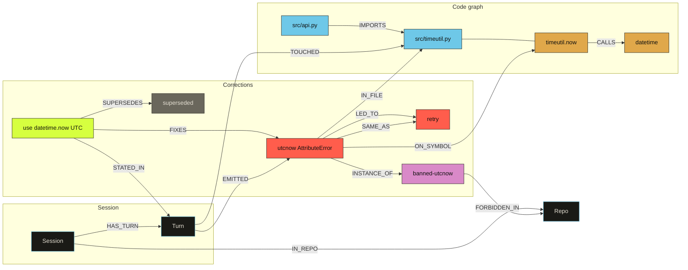
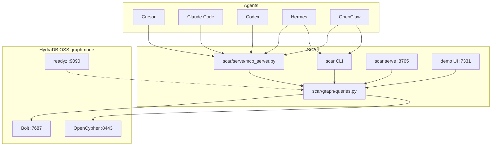

# SCAR

[](LICENSE)

[](https://github.com/hydra-db/hydradb)
[](https://www.python.org/)


### Stored Corrections And Recall. **The next session pulls the sentence you already taught.**

A HydraDB graph of coding-agent errors, human corrections, and the edges between them. Cursor, Claude Code, Codex, Hermes, and OpenClaw query that graph before they edit, and write a new scar after you correct them. Empty neighborhood: the tool abstains.

**[ The graph ↗ ](#the-graph)** · **[ Verify it yourself ↗ ](#verify-it-yourself-in-60-seconds)** · **[ Five agents ↗ ](#five-agents)** · **[ Commands ↗ ](#commands)** · **[ Honesty table ↗ ](#whats-real-vs-simplified)** · **[ HydraDB ↗ ](HYDRA.md)**

Built for **Hack Hydra** — track **2B** (code graphs for IDE assistants). System of record: HydraDB OSS `graph-node` on `127.0.0.1`.

---

## Table of contents

- [The problem](#the-problem)
- [Why it is different](#why-it-is-different)
- [The graph](#the-graph)
- [Verify it yourself in 60 seconds](#verify-it-yourself-in-60-seconds)
- [Five agents](#five-agents)
- [Architecture](#architecture)
- [Requirements](#requirements) · [Install](#install) · [HydraDB](#hydradb)
- [Record and recall](#record-and-recall)
- [Commands](#commands)
- [MCP tools](#mcp-tools-stdio)
- [HTTP](#http)
- [What's real vs simplified](#whats-real-vs-simplified)
- [Engineering decisions](#engineering-decisions)
- [Layout](#layout) · [Troubleshooting](#troubleshooting) · [License](#license)

---

## The problem

You correct one coding agent on a file. You open the next agent on the same repo. The change is gone. The error is the same. The sentence you already said lives in a chat that ended.

That is time, and it is effort, spent teaching tools that drop the instruction when the session closes. Five agents on one desk means five copies of the same lecture.

## Why it is different

SCAR stores the file, the error, and the fix as a graph, then hands that graph to every agent on the desk.

1. **HydraDB does the recall.** The walk is Cypher: current file, then `IMPORTS` / `CALLS` neighbors, then error signature. Active corrections that sit behind `SUPERSEDES` stay hidden. `blast_radius` is `IMPORTS*`. Those queries are the product. A row of "lessons" cannot answer them.
2. **One graph, three doors.** The `scar` CLI, MCP tools over stdio (`python -m scar.serve.mcp_server`), and HTTP `:8765` hit the same `queries.py`. Cursor, Claude Code, Codex, Hermes, and OpenClaw pick the door they already speak.
3. **Abstain is a result.** Empty neighborhood prints a fixed line and leaves judgment with the agent. SCAR does not invent a house rule.

## The graph

HydraDB stores this ontology. Recall returns an active correction or the abstain line.



Legend matches the demo UI: cyan File, gold Symbol, red Error, acid Correction, mauve AntiPattern, grey superseded.

| Query / edge | What HydraDB answers |
|---|---|
| `recall_for_context` | Errors on this file, then `IMPORTS` / `CALLS` neighbors, then signature match. Active corrections only. |
| `FIXES` | This correction repairs that error. |
| `SUPERSEDES` | The older correction is dead. Recall skips it. |
| `LED_TO` | Retry chain between errors. |
| `blast_radius` | `(:File)-[:IMPORTS*1..8]->(:File)<-[:IN_FILE]-(:Error {signature})` |

Cypher lives in `scar/graph/queries.py`. File-by-file map: [HYDRA.md](HYDRA.md).

## Verify it yourself in 60 seconds

Unit tests do not need HydraDB:

```bash
.venv/bin/pytest -q
# 78 passed
```

Live path (HydraDB already up). Same Cypher the CLI, MCP tools, HTTP, and demo UI share:

```bash
curl -sS http://127.0.0.1:9090/readyz
.venv/bin/scar recall --repo scar --file src/timeutil.py --error "AttributeError utcnow"
.venv/bin/python scripts/demo_api.py   # http://127.0.0.1:7331/
bash scripts/record_demo.sh            # 60s click path against GET /graph
```

The SVG on `:7331` is `export_graph` from HydraDB. There is no JSON fixture behind it.

## Five agents

HydraDB up first: `curl -sS http://127.0.0.1:9090/readyz`. Point every config at this clone's `.venv/bin/python` and repo root.

| Agent | Speaks | Config |
|---|---|---|
| **Cursor** | MCP stdio + rule | [integrations/mcp.json.example](integrations/mcp.json.example), [integrations/cursor-rule.mdc](integrations/cursor-rule.mdc) |
| **Claude Code** | MCP stdio + skill | [integrations/claude.mcp.json.example](integrations/claude.mcp.json.example), [integrations/claude-skill.md](integrations/claude-skill.md) |
| **Codex** | MCP stdio | [integrations/codex.toml.example](integrations/codex.toml.example) |
| **Hermes** | MCP stdio or CLI | [integrations/hermes.yaml.example](integrations/hermes.yaml.example) |
| **OpenClaw** | MCP registry or CLI | [integrations/openclaw.json.example](integrations/openclaw.json.example) |

Session extractors (history → JSONL) cover Cursor, Claude Code, and Codex. Hermes and OpenClaw use the live loop: `scar record` after a correction, `scar recall` before the next edit. Wiring notes: [integrations/README.md](integrations/README.md).

## Architecture

Agents never own a second store. They call SCAR. SCAR calls HydraDB.

```text
Cursor / Claude Code / Codex / Hermes / OpenClaw
        │
        ├─ MCP     python -m scar.serve.mcp_server ─┐
        ├─ CLI     scar recall / scar record ───────┤
        └─ HTTP    :8765 /v1/recall /v1/record ─────┤
                                                       ▼
local sessions → extract → mine → HydraDB OSS graph-node
                                       └─ demo UI :7331
```



- Bolt is primary. OpenCypher HTTP is the fallback. Token from `.env` or `hydradb-data/auth-token`.
- `scripts/demo_api.py` exits if `:9090` is down.
- MCP tools are this repo's stdio JSON-RPC loop. Agents spawn `.venv/bin/python -m scar.serve.mcp_server`.

## Requirements

- Python 3.11+
- Docker, for HydraDB OSS `graph-node` (`ghcr.io/hydra-db/hydradb:latest`)

## Install

```bash
git clone https://github.com/fozagtx/scar.git
cd scar
python3 -m venv .venv
.venv/bin/pip install -e .
```

### HydraDB

```bash
./scripts/init-hydradb-data.sh
UID=$(id -u) GID=$(id -g) docker compose up
```

Wait until `curl -sS http://127.0.0.1:9090/readyz` succeeds. Bind: Bolt `7687`, OpenCypher HTTP `8443`, admin `9090`. `init-hydradb-data.sh` writes gitignored `./.env` and `./hydradb-data/`.

| Variable | Default | Used by |
|---|---|---|
| `HYDRA_BOLT_URI` | `bolt://127.0.0.1:7687` | Graph client |
| `HYDRA_HTTP_URI` | `http://127.0.0.1:8443` | HTTP Cypher fallback |
| `HYDRA_AUTH_TOKEN` | token file / local-dev token | Bolt and HTTP |
| `HYDRA_ADMIN_URI` | `http://127.0.0.1:9090` | Readiness |
| `SCAR_DEMO_PORT` | `7331` | Demo UI |

## Record and recall

Extract local Cursor / Claude Code / Codex history, mine it, then query:

```bash
.venv/bin/python -m scar.ingest extracted.jsonl --source all
.venv/bin/scar ingest extracted.jsonl --repo scar

.venv/bin/scar recall --repo scar --file src/timeutil.py --error "AttributeError utcnow"
.venv/bin/scar record --repo scar --file src/timeutil.py \
  --correction "use datetime.now with timezone.utc" \
  --error "AttributeError utcnow"

.venv/bin/python scripts/demo_api.py
```

Open http://127.0.0.1:7331/ . Missing assistant installs write `0` sessions on extract. Record from a live session instead.

## Commands

Extract writes JSONL from local assistant history. Graph commands need HydraDB.

| Step | Command | HydraDB |
|---|---|---|
| Extract transcripts | `.venv/bin/python -m scar.ingest extracted.jsonl --source all` | |
| Mine JSONL into the graph | `.venv/bin/scar ingest extracted.jsonl --repo my-repo` | yes |
| Recall | `.venv/bin/scar recall --repo my-repo --file src/timeutil.py --error "AttributeError utcnow"` | yes |
| Record | `.venv/bin/scar record --repo my-repo --file src/timeutil.py --correction "use datetime.now with timezone.utc"` | yes |
| Abstain helper | `.venv/bin/scar abstain-check --repo my-repo --file src/timeutil.py` | yes |
| HTTP API | `.venv/bin/scar serve --host 127.0.0.1 --port 8765` | yes |
| MCP stdio | `.venv/bin/python -m scar.serve.mcp_server` | yes |
| Demo UI | `.venv/bin/python scripts/demo_api.py` | yes |
| Tests | `.venv/bin/pytest` | |

```bash
.venv/bin/scar --help

# Extract. Console script: scar-ingest. --source all | cursor | claude-code | codex
.venv/bin/python -m scar.ingest extracted.jsonl --source all

.venv/bin/scar ingest extracted.jsonl --repo my-repo

.venv/bin/scar recall --repo my-repo --file src/timeutil.py --error "AttributeError utcnow"
# optional: --symbol timeutil.now --task "fix the clock helper"

.venv/bin/scar record --repo my-repo --file src/timeutil.py \
  --correction "use datetime.now with timezone.utc" \
  --error "AttributeError utcnow"

.venv/bin/scar abstain-check --repo my-repo --file src/timeutil.py
.venv/bin/scar serve --host 127.0.0.1 --port 8765
```

Recall walks the current file, then neighbors, then signature. Empty neighborhood prints the abstain line.

## MCP tools (stdio)

`scar/serve/mcp_server.py` is a JSON-RPC loop on stdin/stdout: `initialize`, `tools/list`, `tools/call`, `ping`. Cursor, Claude Code, Codex, Hermes, and OpenClaw spawn it as a child process. Same HydraDB calls as `scar recall` / `scar record`.

```bash
.venv/bin/python -m scar.serve.mcp_server
```

`scar mcp` is the argparse alias for that module. Copy-paste configs use `-m scar.serve.mcp_server`: [integrations/mcp.json.example](integrations/mcp.json.example).

| Tool | Required | Optional | What it does |
|---|---|---|---|
| `scar_recall` | `repo_id`, `file_path` | `symbol`, `error_text`, `task_text` | Active corrections, or abstain |
| `scar_record` | `repo_id`, `file_path`, `correction_text` | `error_text` | Write a `human_instruction` now |
| `scar_blast_radius` | `error_id` or `signature` | | Files that `IMPORTS*` the origin |

Cursor MCP settings (replace both `/ABS/PATH/TO/scar` values):

```json
{
  "mcpServers": {
    "scar": {
      "command": "/ABS/PATH/TO/scar/.venv/bin/python",
      "args": ["-m", "scar.serve.mcp_server"],
      "cwd": "/ABS/PATH/TO/scar",
      "env": {
        "HYDRA_BOLT_URI": "bolt://127.0.0.1:7687",
        "HYDRA_HTTP_URI": "http://127.0.0.1:8443",
        "HYDRA_ADMIN_URI": "http://127.0.0.1:9090",
        "HYDRA_AUTH_TOKEN": "local-development-token-32-bytes"
      }
    }
  }
}
```

Claude Code (project `.mcp.json` is the same `mcpServers` shape, or):

```bash
claude mcp add --transport stdio scar \
  --env HYDRA_BOLT_URI=bolt://127.0.0.1:7687 \
  --env HYDRA_HTTP_URI=http://127.0.0.1:8443 \
  --env HYDRA_ADMIN_URI=http://127.0.0.1:9090 \
  --env HYDRA_AUTH_TOKEN=local-development-token-32-bytes \
  -- /ABS/PATH/TO/scar/.venv/bin/python -m scar.serve.mcp_server
```

Then copy [integrations/claude-skill.md](integrations/claude-skill.md) into `.claude/skills/`. Copy [integrations/cursor-rule.mdc](integrations/cursor-rule.mdc) into `.cursor/rules/`.

Codex, Hermes, OpenClaw: [integrations/codex.toml.example](integrations/codex.toml.example), [integrations/hermes.yaml.example](integrations/hermes.yaml.example), [integrations/openclaw.json.example](integrations/openclaw.json.example).

Smoke (HydraDB up; the process connects on start):

```bash
printf '%s\n' '{"jsonrpc":"2.0","id":1,"method":"initialize","params":{"protocolVersion":"2024-11-05","capabilities":{},"clientInfo":{"name":"scar-readme","version":"0"}}}' \
  '{"jsonrpc":"2.0","id":2,"method":"tools/list","params":{}}' \
  | .venv/bin/python -m scar.serve.mcp_server
```

`tools/list` returns `scar_recall`, `scar_record`, `scar_blast_radius`.

## HTTP

```bash
.venv/bin/scar serve
```

```bash
curl -sS http://127.0.0.1:8765/healthz

curl -sS -X POST http://127.0.0.1:8765/v1/recall \
  -H 'Content-Type: application/json' \
  -d '{"repo_id":"my-repo","file_path":"src/timeutil.py","error_text":"AttributeError utcnow"}'

curl -sS -X POST http://127.0.0.1:8765/v1/record \
  -H 'Content-Type: application/json' \
  -d '{"repo_id":"my-repo","file_path":"src/timeutil.py","correction_text":"use datetime.now with timezone.utc","error_text":"AttributeError utcnow"}'
```

| Method | Path | Body |
|---|---|---|
| `GET` | `/healthz` | |
| `POST` | `/v1/recall` | `repo_id`, `file_path`, optional `symbol`, `error_text`, `task_text` |
| `POST` | `/v1/record` | `repo_id`, `file_path`, `correction_text`, optional `error_text` |

## What's real vs simplified

| Capability | Status |
|---|---|
| HydraDB OSS as the system of record | Real. Local `graph-node`, Bolt then OpenCypher HTTP. [HYDRA.md](HYDRA.md). |
| Neighborhood recall | Real. File, then `IMPORTS` / `CALLS`, then signature. Cypher in `queries.py`. |
| `SUPERSEDES` hides dead corrections | Real. |
| `blast_radius` over `IMPORTS*` | Real. `IMPORTS*1..8`. |
| Abstain on empty neighborhood | Real. Fixed prompt line. Tests in `tests/test_prompt.py`. |
| CLI `scar ingest` / `recall` / `record` / `serve` | Real. `scar.cli:main`. |
| MCP tools over stdio | Real. In-repo `scar/serve/mcp_server.py`. Agents spawn `python -m scar.serve.mcp_server`. |
| HTTP `:8765` | Real. Stdlib `http.server`. `POST /v1/recall`, `POST /v1/record`. |
| Demo UI `:7331` | Real. Live `export_graph`. Exits if HydraDB is down. |
| Cursor / Claude Code / Codex extractors | Real. `python -m scar.ingest`. |
| Hermes / OpenClaw extractors | Not built. Those agents use CLI, MCP stdio, or HTTP. |
| HydraDB Cloud / `api.hydradb.com` | Unused. On purpose. |
| Vector recall as the store | Unused. On purpose. |
| Public hosted demo | Local only: `:7331` after compose. Repo: https://github.com/fozagtx/scar |

## Engineering decisions

HydraDB has to do real work. These choices are how that rule shows up in the tree.

- **Cypher has one home.** Named ops live in `scar/graph/queries.py`. The CLI, MCP loop, HTTP API, miner, and demo UI call those names. Swapping the store means swapping that file.
- **MCP is a module in this repo.** `mcp_server.py` speaks JSON-RPC on stdin/stdout with the stdlib. Cursor's `mcpServers` block runs `.venv/bin/python -m scar.serve.mcp_server`. `scar mcp` is the argparse alias.
- **Extract and mine are different commands.** `python -m scar.ingest` writes JSONL from local transcripts. `scar ingest extracted.jsonl --repo …` upserts into HydraDB. Mixing them is the usual first-run failure.
- **The demo UI has no fixture fallback.** `scripts/demo_api.py` talks to HydraDB or it exits. Judges see the live graph.
- **Bolt first, HTTP Cypher second.** `GraphClient.query` uses the neo4j driver, then `httpx` against `:8443`.
- **MERGE on `id`.** The OpenCypher subset may not give unique constraints, so upserts key on stable ids.

## Layout

```text
scar/
  cli.py                 scar ingest|recall|record|serve|mcp
  graph/                 client, schema, queries (Cypher)
  ingest/                extractors, mine, load_graph
  serve/                 http_api, mcp_server, prompt
integrations/            Cursor, Claude Code, Codex, Hermes, OpenClaw
scripts/                 init-hydradb-data.sh, demo_api.py, record_demo.sh
ui/                      demo SVG on :7331
tests/
fixtures/transcripts/
HYDRA.md
docker-compose.yml
```

## Troubleshooting

**Demo UI needs HydraDB.** `scripts/demo_api.py` exits if `:9090` is down. Extract and ingest first.

**`docker compose up` cannot write the store.** Pass `UID=$(id -u) GID=$(id -g)`, or let `.env` set them after `init-hydradb-data.sh`.

**Live recall / stdio / HTTP fail to connect.** `graph-node` is down. Check `curl -sS http://127.0.0.1:9090/readyz` and `HYDRA_BOLT_URI`. Spawn `python -m scar.serve.mcp_server` with `cwd` at the repo root so `.env` resolves.

**Extractors print nothing.** Missing Cursor / Claude Code / Codex installs return `[]`. Hermes and OpenClaw have no extractors; `scar record` from the live session.

**Ports.** Agent HTTP `:8765`. Demo UI `:7331`. HydraDB `7687` / `8443` / `9090`.

## License

MIT. See [LICENSE](LICENSE). Running HydraDB OSS is a separate AGPL obligation; SCAR talks to `graph-node` over Bolt/HTTP and does not vendor that source. Third-party notices: [NOTICE](NOTICE).
