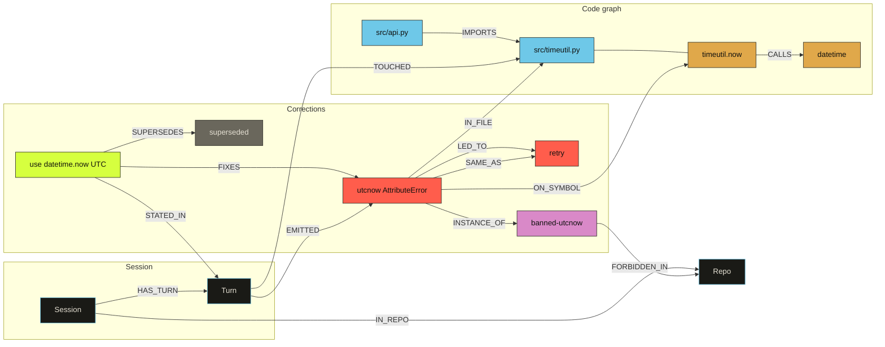

# SCAR

Stored Corrections And Recall. A HydraDB graph of coding-agent errors, human corrections, and the connections between them so the next session does not repeat the same mistake.

Hack Hydra track **2B** (code graphs for IDE assistants). HydraDB OSS is the system of record; details in [HYDRA.md](HYDRA.md).

[](https://www.python.org/)
[](https://github.com/hydra-db/hydradb)
[](https://neo4j.com/docs/bolt/)
[](https://github.com/hydra-db/hydradb)
[](https://www.docker.com/)
[](https://docs.pydantic.dev/)
[](https://modelcontextprotocol.io/)
[](https://docs.pytest.org/)

## Features

- Extract local Cursor, Claude Code, and Codex sessions into one JSONL schema
- Mine error signatures, retry chains (`LED_TO`), and corrections (`FIXES`, `SUPERSEDES`)
- Store the graph in HydraDB OSS (`graph-node` over Bolt/HTTP)
- Recall active corrections for a file/symbol/error; **abstain** when nothing matches
- Blast radius over `IMPORTS*` — which files sit downstream of a failure
- CLI, HTTP (`:8765`), MCP tools, and a no-build demo UI (`:7331`)

## Graph

HydraDB stores this ontology. Recall walks the current file, then `IMPORTS` / `CALLS` neighbors, then error signature. Only an active correction that does not sit behind `SUPERSEDES` is returned. No path → abstain.



Legend: cyan File, gold Symbol, red Error, acid Correction, mauve AntiPattern, grey superseded. Same palette as the demo UI.

`blast_radius` is `(:File)-[:IMPORTS*]->(:File)<-[:IN_FILE]-(:Error {signature})`. A vector index cannot answer that.

## Prerequisites

- Python 3.11+
- Docker (HydraDB OSS `graph-node`)

## Getting started

Install:

```bash
git clone https://github.com/fozagtx/scar.git
cd scar
python3 -m venv .venv
.venv/bin/pip install -e .
```

### 1. Local HydraDB

```bash
./scripts/init-hydradb-data.sh
UID=$(id -u) GID=$(id -g) docker compose up
```

`init-hydradb-data.sh` writes gitignored `./.env` and `./hydradb-data/`. Wait until `curl -sS http://127.0.0.1:9090/readyz` succeeds.

HydraDB stays on `127.0.0.1` (`7687` Bolt, `8443` HTTP, `9090` admin). Not `api.hydradb.com`.

### 2. Ingest real sessions

Extract Cursor / Claude Code / Codex history from this machine, then mine it into the live graph:

```bash
.venv/bin/python -m scar.ingest extracted.jsonl --source all
.venv/bin/scar ingest extracted.jsonl --repo scar
```

Missing assistant installs write `0` sessions. That is expected. You can also `scar record` a correction from a live session.

### 3. Demo UI (live graph)

```bash
.venv/bin/python scripts/demo_api.py
```

Open http://127.0.0.1:7331/ . The SVG is `GET /graph` from HydraDB. Recall and blast call the same Cypher as the CLI. Click path: `bash scripts/record_demo.sh`.

### 4. Local MCP

Copy [integrations/mcp.json.example](integrations/mcp.json.example) into Cursor MCP settings. Point `command` at this repo's `.venv/bin/python` and `cwd` at the repo root. HydraDB must already be up. Cursor then spawns `python -m scar.serve.mcp_server` on stdio.

Optional: copy [integrations/cursor-rule.mdc](integrations/cursor-rule.mdc) into `.cursor/rules/`. Claude Code: [integrations/claude-skill.md](integrations/claude-skill.md).

HTTP API (also local): `.venv/bin/scar serve` → `http://127.0.0.1:8765`.

Tests:

```bash
.venv/bin/pytest
```

## Usage

Ingest assistant history, then query or record:

```bash
.venv/bin/python -m scar.ingest extracted.jsonl --source all
.venv/bin/scar ingest extracted.jsonl --repo my-repo

.venv/bin/scar recall --repo my-repo --file path/to/file.py --error "the error text"
.venv/bin/scar record --repo my-repo --file path/to/file.py --correction "the human instruction"
```

| Command | What it does |
|---|---|
| `scar ingest <jsonl> --repo <id>` | Mine JSONL and upsert into HydraDB |
| `scar recall --repo --file [--error] [--symbol]` | Print active corrections or abstain |
| `scar record --repo --file --correction` | Write a human correction now |
| `scar abstain-check --repo --file` | Exit 0 only if recall abstains |
| `scar serve` | HTTP API on `127.0.0.1:8765` |
| `scar mcp` | MCP stdio (`scar_recall`, `scar_record`, `scar_blast_radius`) |

Recall walks the current file, then `CALLS` / `IMPORTS` neighbors, then error signature. It keeps only `active` corrections that are not the target of `SUPERSEDES`. Empty neighborhood → abstain, never invent a house rule.

```text
local sessions  →  extract  →  mine  →  HydraDB OSS
                                         ├─ scar CLI / MCP / HTTP :8765
                                         └─ demo UI :7331 (GET /graph from HydraDB)
```

## Configuration

`./scripts/init-hydradb-data.sh` writes `.env` from `.env.example` values plus host `UID`/`GID`. Compose needs those so the container can write `hydradb-data/`.

| Variable | Default | Used by |
|---|---|---|
| `HYDRA_BOLT_URI` | `bolt://127.0.0.1:7687` | Graph client |
| `HYDRA_HTTP_URI` | `http://127.0.0.1:8443` | HTTP Cypher fallback |
| `HYDRA_AUTH_TOKEN` | token file / local-dev token | Bolt and HTTP |
| `HYDRA_ADMIN_URI` | `http://127.0.0.1:9090` | Readiness |
| `SCAR_DEMO_PORT` | `7331` | Demo UI bind port |

Image: `ghcr.io/hydra-db/hydradb:latest`. SCAR does not call `api.hydradb.com`. Cypher lives only in `scar/graph/queries.py`. File-by-file map: [HYDRA.md](HYDRA.md).

## Troubleshooting

**Demo UI requires HydraDB.** `scripts/demo_api.py` exits if `:9090` is down. Ingest real sessions first.

**`docker compose up` cannot write the store.** The image runs as UID 10001; bind mounts are host-owned. Always pass `UID=$(id -u) GID=$(id -g)` (or let `.env` set them after `init-hydradb-data.sh`).

**Live `scar recall` fails with connection errors.** `graph-node` is not up. Check `curl -sS http://127.0.0.1:9090/readyz` and `HYDRA_BOLT_URI`.

**Extractors print nothing.** Missing Cursor / Claude Code / Codex installs return `[]`. That is expected.

**Port clash.** Agent HTTP is `:8765` (`scar serve`). Demo UI is `:7331`. HydraDB is `7687` / `8443` / `9090`.
