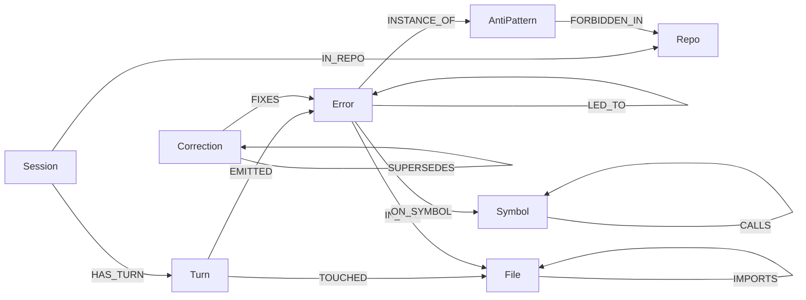

# SCAR

Stored Corrections And Recall: a HydraDB graph of the mistakes coding agents already made, and the human corrections that should stop them making those mistakes again.

## Problem

Coding agents repeat themselves. A human says "do not use `datetime.utcnow`, we already banned that." The next session embeds the repo, retrieves a nearby chunk, and does it anyway. Similarity is a weak proxy. Two opposed rules ("use utcnow" / "never use utcnow") sit next to each other in vector space. Chronology and overwrite are edges, not cosine.

SCAR extracts local Cursor, Claude Code, and Codex transcripts, mines errors and corrections, and stores the **connections** in HydraDB OSS: `FIXES`, `LED_TO`, `SAME_AS`, `CALLS`, `IMPORTS`, `SUPERSEDES`. Before an agent edits, it asks the graph. If nothing matches, the graph **abstains** instead of inventing a house rule.

The workstation graph (no Node, no CDN) is the demo:

```text
python scripts/demo_api.py
# open http://127.0.0.1:7331/
```

Three panes, graph in the center, superseded corrections struck through. Click path: [docs/demo-script.md](docs/demo-script.md).

## Graph model



## Why HydraDB

HydraDB OSS is the system of record. `scar/graph/queries.py` is the only file that contains Cypher. `recall_for_context` returns active corrections on the current file, then on `CALLS` / `IMPORTS` neighbors, then by error signature, and drops any correction that another node `SUPERSEDES`. `blast_radius` runs `IMPORTS*1..8` from every file that emitted the same signature — the files an IDE assistant is about to touch if it repeats the failure.

A SQLite table of lesson strings cannot answer "which importers are in the blast radius of this `AttributeError`?" without reimplementing a graph. Vector search will rank the superseded utcnow advice next to the ban. The graph keeps one live `Correction` and a dead one behind `SUPERSEDES`.

See [HYDRA.md](HYDRA.md) for the file-by-file map, ports, and the queries.

## Quick start

Python 3.11+. Docker only if you want a live `graph-node`.

**Minimal (fixture UI, no HydraDB):**

```bash
python3 -m venv .venv
.venv/bin/pip install -e .
.venv/bin/python scripts/demo_api.py
# http://127.0.0.1:7331/
.venv/bin/pytest
```

**Full (HydraDB OSS + seed + CLI):**

```bash
./scripts/init-hydradb-data.sh
UID=$(id -u) GID=$(id -g) docker compose up
# wait until :9090 /readyz is up
.venv/bin/python scripts/seed_fixture_graph.py
.venv/bin/scar recall --repo demo-repo --file src/timeutil.py --error "AttributeError utcnow"
.venv/bin/scar abstain-check --repo demo-repo --file src/unrelated.py
```

**Ingest local assistant history (optional):**

```bash
.venv/bin/python -m scar.ingest extracted.jsonl --source all
.venv/bin/scar ingest extracted.jsonl --repo demo-repo
```

**MCP** (Cursor / Claude Desktop): copy [integrations/mcp.json.example](integrations/mcp.json.example). Tools: `scar_recall`, `scar_record`, `scar_blast_radius`. Rule/skill: [integrations/cursor-rule.mdc](integrations/cursor-rule.mdc), [integrations/claude-skill.md](integrations/claude-skill.md).

HTTP for agents is `scar serve` on `127.0.0.1:8765`. The demo UI is a separate process on `7331`.

## How HydraDB OSS is used

Image `ghcr.io/hydra-db/hydradb:latest`. Bolt `7687`, HTTP `8443`, admin `9090`. SCAR never calls `api.hydradb.com`.

Without HydraDB you can still show the fixture UI. You cannot persist scars across sessions, run live `scar recall`, or execute `IMPORTS*` blast radius against a real graph. That is the point of the track.

## Architecture

```text
Cursor / Claude Code / Codex (local disk)
              |
              v
     extractors  ->  frozen JSONL
              |
              v
     miner (signatures, LED_TO, SUPERSEDES)
              |
              v
     HydraDB OSS graph-node
              |
        +-----+-----+
        v           v
   CLI / MCP / HTTP     demo UI :7331
   scar  :8765
```

Extractors are optional. The miner is deterministic (no LLM). The graph client is Bolt-first with HTTP fallback. Recall abstains when the neighborhood is empty.

## Extractors

`scar/ingest/extractors/` reads local Cursor, Claude Code, and Codex session stores (SQLite and JSONL) into one frozen JSONL schema. Missing installs return an empty list.

## Track, team, license

- **Hack Hydra track:** 2B — Code graphs for IDE assistants.
- Supersession, chronology, and abstention are Track 3 behaviors used as graph features, not a second submission.
- **License:** MIT for SCAR. HydraDB remains a Docker runtime under AGPL-3.0. See [LICENSE](LICENSE) and [NOTICE](NOTICE).
- **Tests:** `pytest` — currently 80 passed, 1 skipped (live HydraDB).
- **Video shot list:** [docs/demo-script.md](docs/demo-script.md). Form paste: [docs/submission.md](docs/submission.md).
